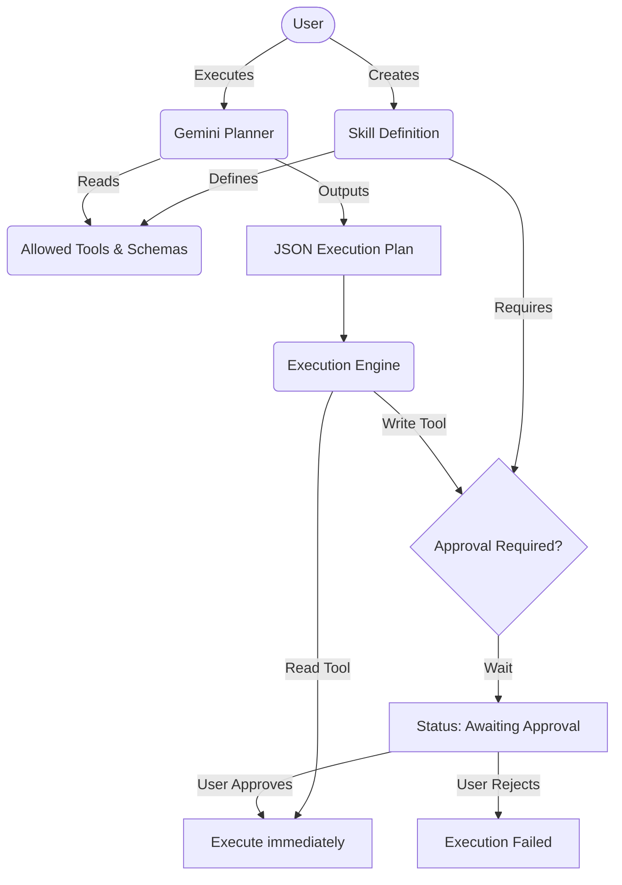

# Aggroso — Dynamic User-Defined Skills Agent Platform

## Overview
Aggroso is a platform that allows users to define custom, version-controlled "Skills" for an AI agent, and execute them safely. It provides a structured planning engine powered by Gemini, enforcing rigid input/output schemas and a strict human-in-the-loop approval gate for any write actions.

## Architecture

The system is built on a split Node.js/Express backend and React/Vite frontend. The core execution loop relies on atomic MongoDB updates and deterministic idempotency keys to ensure that a paused execution can be safely resumed after user approval without double-executing side effects.



## Setup

### Prerequisites
- Node.js 18+
- MongoDB (local or Atlas)

### Server
```bash
cd server
cp .env.example .env        # fill in MONGODB_URI, PORT, GEMINI_API_KEY
npm install
npm run dev                  # starts Express on :5000
```

### Client
```bash
cd client
npm install
npm run dev                  # starts Vite on :5173, proxies /api to :5000
```

### Tests
```bash
cd server
npm test
```

## Completed Scope
- **Skill Definition & Versioning:** Define instructions, schemas, and allowed tools. Published skills are immutable; edits create new versions linked via `previousVersionId`.
- **Version History & Diffs:** View a skill's full lineage, compute structured field-level diffs between versions, and explicitly re-run historical versions.
- **Execution Engine & Planning:** Gemini Flash translates user input into a deterministic JSON plan of steps.
- **Human-in-the-Loop Approval:** Any tool marked as requiring approval pauses the execution engine. Users review the pending step in the UI and approve/reject it.
- **Idempotency:** Approved write tools use cryptographic hashes of the execution context to prevent duplicate writes during retries.
- **Audit Logs:** Global paginated execution history and step-level audit trails for every run.
- **Structured Logging:** Centralized JSON logging for production observability.

## Intentionally Excluded Scope
- **Dynamic Tool Registry:** The tool surface (calculator, docSearch, recordLookup, taskCreator) is hardcoded. Allowing users to inject arbitrary code for new tools would break the security sandbox and audit guarantees.
- **Multi-Agent Orchestration:** The engine uses a single LLM call for planning and a second for synthesis. Multi-agent delegation was deemed overly complex for the rigid schema-driven requirements.
- **Vector Search Database:** The `docSearch` tool uses seeded hardcoded data and simple keyword matching. Setting up Pinecone/Elasticsearch would add infrastructure without meaningfully improving the demonstration of the approval-gate pattern.
- **Authentication/AuthZ:** There is no login system or RBAC. All users are "admin" for the sake of the prototype.

## Known Limitations
- **Polling UI:** The frontend execution trace uses HTTP polling (every 2.5s) instead of WebSockets or Server-Sent Events. This is fine for a prototype but wouldn't scale to thousands of active executions.
- **Sequential History Fetching:** Walking the `previousVersionId` chain is done sequentially. For skills with hundreds of versions, this would cause N+1 query performance issues.

## Deployment
- **Frontend:** Vercel (https://vercel.com)
- **Backend:** Render (https://render.com)
- **Database:** MongoDB Atlas Free Tier
